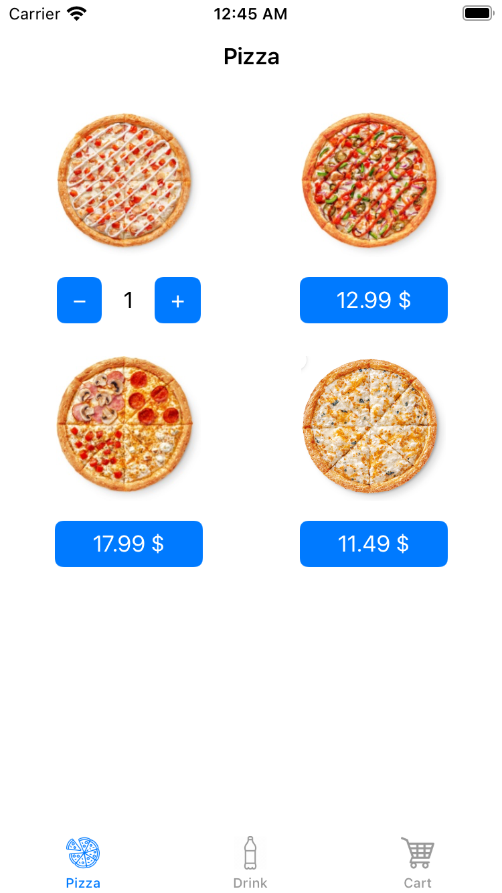
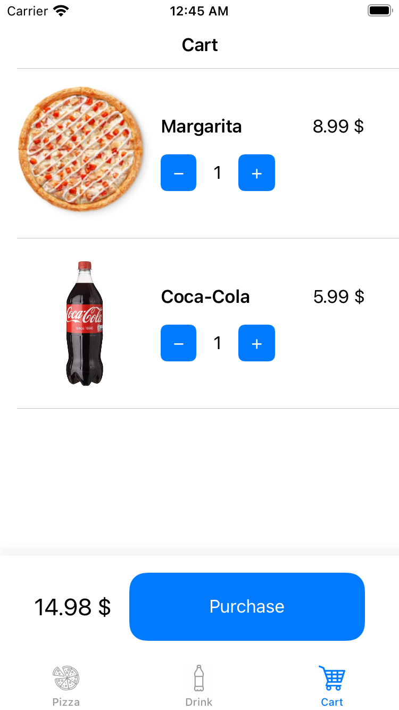
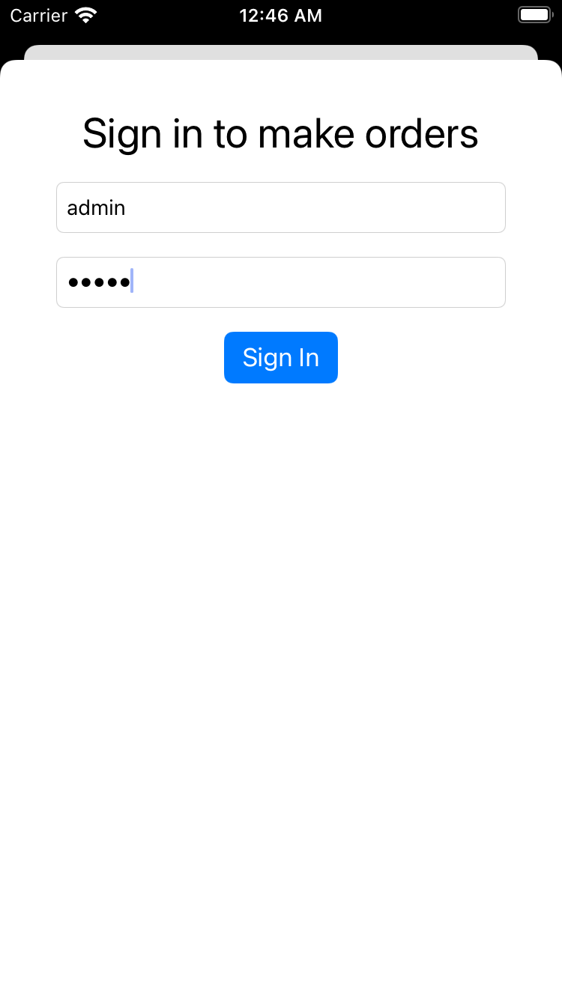

# Pizza Order Demo

This app demonstrates how to use RxFeedback in different parts of your app.

Whether you want to build whole feature with Unidirectional Data Flow or integrate it step-by-step, RxFeedback gives you this opportunity.

## Features
* App has three screens each built with different architecture MVVM/VIPER/RxFeedback-MVVM
* Unit tests on ViewModel and RxFeedback based Store

## Screenshots

## Requirements

* iOS 15
* Swift 5
* Swift Package Manager
